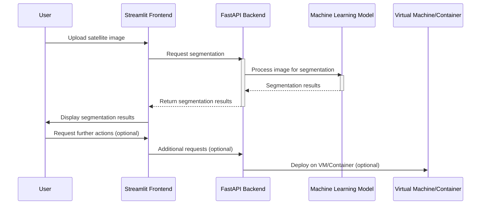

# ML System Design Doc
## Дизайн ML системы - RaisonText MVP

### 1. Цели и предпосылки
#### 1.1. Зачем идем в разработку продукта?

- Бизнес-цель:
  - Заменить ручную работу по заполнению резюме на автогенерацию, чтобы:
    - увеличить процент притока новых пользователей с сохранением или уменьшением процента оттока старых пользователей.
    - уменьшить время на составление хорошего резюме, которое не пройдет мимо рекрутеров и HR служб, тем самым подняв уровень удовлетворенности пользователей-соискателей платформой в целом

- Почему станет лучше, чем сейчас, от использования ML:
  - Пользователям не придется тратить время и силы на самостоятельное заполнение поля “О себе”, система сама качественно сгенерирует данное поле
 

- Что считаем успехом:
    - Возможность генерировать поле "О себе" по данным от пользователя.
    - Наличие MVP с демонстрацией работы генерации текста по данным из резюме

#### 1.2. Бизнес-требования и ограничения  

- Бизнес-требования:

    - Должна быть обучена нейросетевая модель генерации поля "О себе" по заданным данным пользователя (резюме).
    - Модель не должна генерировать ложную информацию о пользователе.
    - Модель должна быть завернута в сервис для удобной работы (с веб-интерфейсом) для демонстрации
    - Модель не должна генерировать ничего, кроме поля "О себе"
    - Модель должна быть обучена посредством SFT.

- Бизнес-ограничения:
    - Срок сдачи пилота - конец июля 2025 года.

- Что мы ожидаем от конкретной итерации:
    - Обучение SFT модели для генерации поля “О себе”
    - Генерация 12000 примеров поля “О себе” с помощью обученной SFT модели
    - Генерация 5000 пар хороших-плохих ответов для обучения DPO
    - Разметка сгенерированных данных для обучения DPO модели
    - Обучение DPO
    - Интеграция модели после DPO в сервис
    - Подготовка демо-версии сервиса

- Описание бизнес-процесса пилота:
    - В данной итерации не планируется интеграция модели в существующий бизнес-процесс.
  

- Что считаем успешным пилотом?
	- Критерии успеха: экспертные оценки от HR, рабочий пилотный прототип сервиса
	- Возможные пути развития проекта: обучение моделей на большем количестве данных

#### 1.3 Что входит в скоуп проекта/итерации, что не входит
- Нет интеграции во внутренние системы

#### 1.4 Предпосылки решения
- Проект ведётся в GitLab
- Документация – google docs на google disc
- Код: Python
- Стек: PyTorch, pandas, transformers, FastAPI, streamlit
- БД: PostgreSQL

### 2. Методология

#### 2.1. Постановка задачи

Задача генерация текста.

#### 2.2 Критерии успеха технического решения

Оценка результатов работы модели по генерации текстов является сложной задачей, так как качество генерируемых текстов
зависит от многих факторов, таких как качество входных данных, используемые алгоритмы и параметры модели. Кроме того,
оценка качества текстов в значительной степени зависит от субъективного мнения человека, который оценивает текст.

- **Экспертная оценка**
  - Одним из подходов к оценке результатов работы модели по генерации текстов является экспертная оценка. Экспертная оценка
  подразумевает оценку качества генерируемых текстов специалистами в области лингвистики или других соответствующих областях.
  Эксперты могут оценивать качество текстов по различным критериям, таким как грамматическая корректность, соответствие 
  контексту, естественность и т.д. Однако, экспертная оценка имеет свои ограничения. Во-первых, она может быть достаточно
  дорогостоящей и требует участия высококвалифицированных специалистов. Во-вторых, экспертная оценка может быть субъективной
  и зависеть от личных предпочтений и опыта экспертов.
  
- **A/B тестирование**
  - Другим подходом к оценке результатов работы модели по генерации текстов является проведение А/B-тестов. 
    А/Б-тестирование подразумевает сравнение двух или более вариантов генерируемых текстов с целью определения наиболее 
    эффективного варианта. А/Б-тестирование может быть полезным для оценки качества текстов с точки зрения конверсии, 
    например, при генерации рекламных текстов. Однако, А/Б-тестирование также имеет свои ограничения, так как оно может
    не учитывать всех аспектов качества текстов и может быть неэффективным при оценке текстов, которые не предназначены для конверсии.

#### 2.3. Диаграмма решения задачи

#### 2.4. Этапы решения задачи

**Этап 1. Построение бейзлайна**

- **Шаг 1. Сбор и предобработка данных**

Данные предоставлены Работа.Р за сентябрь-октябрь 2023 года.

Данные имеют следующую структуру:

Признаки:

| Название данных | Есть ли данные в компании | Требуемый ресурс для получения данных | Проверено ли качество данных |
| --- | --- | --- | --- |
| ID резюме | Да (Product Owner/DS) | Product owner /DS | нет, данные представлены в чистом виде |
| Почта | Да (Product Owner/DS) | Product owner /DS | нет, данные представлены в чистом виде |
| Пол | Да (Product Owner/DS) | Product owner /DS | нет, данные представлены в чистом виде |
| Дата рождения | Да (Product Owner/DS) | Product owner /DS | нет, данные представлены в чистом виде |
| Нижняя планка зарплаты | Да (Product Owner/DS) | Product owner /DS | нет, данные представлены в чистом виде |
| Город проживания | Да (Product Owner/DS) | Product owner /DS | нет, данные представлены в чистом виде |
| Семейное положение | Да (Product Owner/DS) | Product owner /DS | нет, данные представлены в чистом виде |
| Водительские права | Да (Product Owner/DS) | Product owner /DS | нет, данные представлены в чистом виде |
| Страна проживания | Да (Product Owner/DS) | Product owner /DS | нет, данные представлены в чистом виде |

Целевые переменные:

| Название данных | Есть ли данные в компании | Требуемый ресурс для получения данных | Проверено ли качество данных |
| --- | --- | --- | --- |
| Поле “О себе” | Да (Product Owner/DS) | Product owner /DS | нет, данные представлены в чистом виде |
| Рекомендательное письмо | Да (Product Owner/DS) | Product owner /DS | нет, данные представлены в чистом виде |

На данном этапе проводится предобработка данных:
1. Произведена обработка пропущенных значений, удалены неинформативные признаки и признаки с большим количеством пропусков. 
2. Удалены данные о резюме, в которых не указано ни одной из целевых переменных. 
3. На основе полученных признаков сформировано текстовое поле с текстом резюме.

- **Шаг 2. SFT**
  - В качестве модели была выбрана “IlyaGusev/rut5_base_sum_gazeta”.
  На основе данных полученных на 1 шаге выбранная модель дообучается, чтобы она могла генерировать поле “О себе” на основе текста резюме.
- **Шаг 3. Анализ модели**
  - Проведение анализа генераций, полученных с помощью обученной SFT модели.
- **Шаг 4. Обогащение данных**
  - Обогащение данных путем добавления информации о навыках и последних откликах соискателей. Добавление данных, сгенерированных с помощью СhatGPT и Gigachat
- **Шаг 5. SFT на обогащенных данных**
  - Дообучение SFT модели на обогащенных данных, полученных на шаге 4.
- **Шаг 6. Развертывание SFT модели**
  - Написание сервиса с использованием streamlit и fastapi, который, используя обученную на обогащенных данных SFT модель, позволяет генерировать поле “О себе” на основе входных данных о поле, возрасте, месте проживания, водительском удостоверении, желаемой зарплате, опыте работы и навыках.

**Этап 2. Построение пилота**

- **Шаг 1.** Генерация данных с помощью итоговой SFT модели
Используя SFT модель производятся 4 генерации для каждого резюме в данных
- **Шаг 2.** Разметка сгенерированных данных
Для каждого резюме происходит ранжирование генераций
- **Шаг 3.** Обучение DPO модели
Обучение Reward модели на размеченных данных
- **Шаг 4.** Дообучение SFT модели с помощью DPO модели
Используя обученную на размеченных нами данных Reward модель дообучаем SFT модель генерировать только хорошие примеры поля “О себе”
- **Шаг 5.** Развертывание итоговой SFT модели 
Написание сервиса с использованием streamlit и fastapi, который, используя дообученную с помощью Reward модели SFT модель, позволяет генерировать поле “О себе” на основе входных данных о поле, возрасте, месте проживания, водительском удостоверении, желаемой зарплате, опыте работы и навыках

**Этап 3. Создание финального отчета**

Задачи:
- Подготовка презентации проекта

#### 2.5. Данные для задачи

Были использованы обезличенные данные (резюме) предоставленные команией Работа.ру

### 3. Внедрение
#### 3.1. Архитектура решения

#### 3.2. Описание инфраструктуры и масштабируемости

Проект по генерации поля "О себе" по заданным данным пользователя (резюме) будет основана на 
совместном использовании Streamlit и FastAPI.

**Инфраструктура** включает в себя:
- Развертывание FastAPI приложения на нескольких серверах с помощью контейнеризации для обеспечения изоляции и масштабируемости.
- Использование базы данных PostgreSQL для хранения данных резюме и генерируемых текстов "О себе".
- Использование Streamlit для создания пользовательского интерфейса и взаимодействия с FastAPI приложением.
- Использование SSL-сертификатов для обеспечения безопасного соединения и защиты данных.
- Регулярное автоматизированное создание резервных копий базы данных для обеспечения безопасности и доступности данных.
- Мониторинг и логирование системы для отслеживания производительности и устранения неполадок.

**Масштабируемость** будет реализована за счет:
- Горизонтального масштабирования:
  - Разделение нагрузки между несколькими экземплярами FastAPI с помощью балансировщиков нагрузки.
    Масштабирование базы данных PostgreSQL с помощью репликации и шардирования.

- Вертикального масштабирования:
  - Увеличение ресурсов серверов (CPU, RAM) для повышения производительности.
    Оптимизация запросов к базе данных и кэширование часто используемых данных.
    
- Обработки запросов:
  - Асинхронная обработка запросов в FastAPI для увеличения пропускной способности.
  - Использование очередей сообщений (RabbitMQ, Kafka) для управления асинхронными задачами.

#### 3.3. Технические требования

**Минимальный состав аппаратных средств**

Технические средства должны включать в себя следующие программные и аппаратные составляющие:

- персональный компьютер с операционной системой Ubuntu 20:04 и выше
- процессор с частотой не менее 3 ГГц
- GPU видеокарту серии NVIDIA GTX 1080Ti и выше
- наличие устройств ввода
- оперативную память не менее 8Гб
- жесткий диск объемом 40 Гб и выше

**Минимальный состав программных средств**

Для функционирования программы необходимы следующие программные средства:

- python версии 3.8 или выше и установленные зависимости;
- набор инструментов CUDA для Linux версии 11.3 или выше.

#### 3.4. Требования к работе системы
Пропускная способность и задержка обеспечивается структурой и возможностью масштабирования

#### 3.5. Безопасность системы
Обеспечивается отсутствием внешних связей
